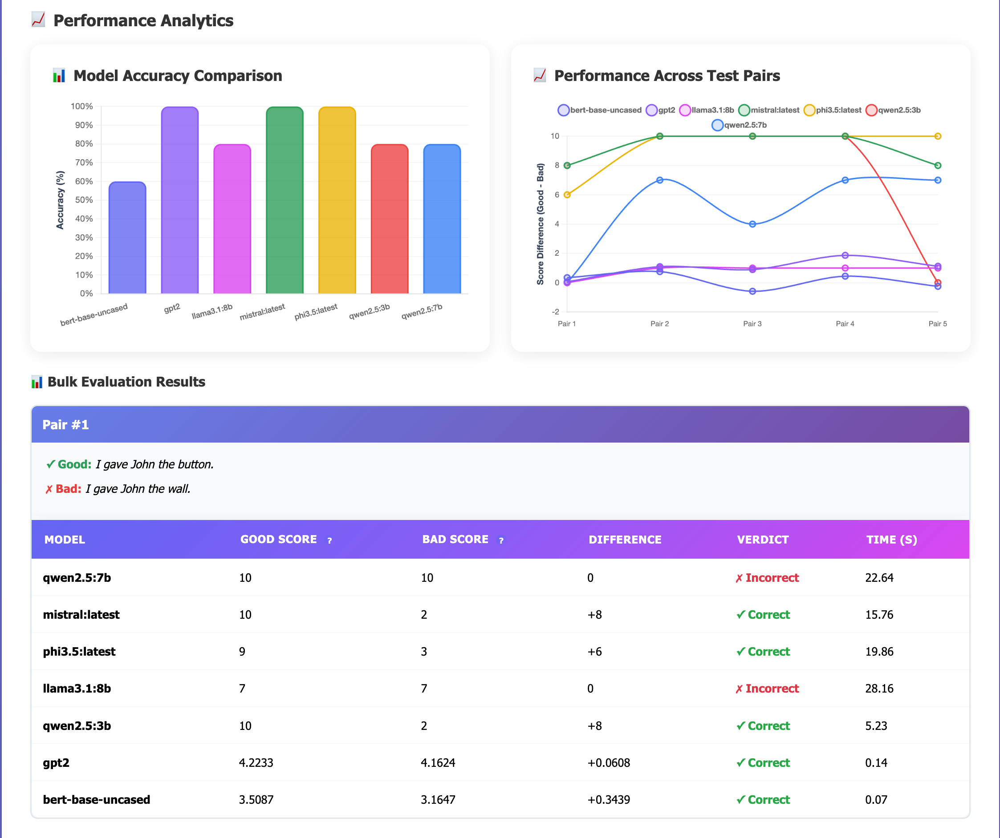
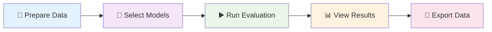

<div align="center">

# 🎓 AIS710: BLIMP Evaluation Interface



<br>

### 🚀 A Comprehensive Web-Based Evaluation System for Language Models

<p align="center">
  <i>Testing minimal sentence pairs for grammatical correctness and semantic plausibility</i>
</p>

<p align="center">
  <a href="#-quick-start"></a>
  <a href="#-features"></a>
  <a href="#-installation"></a>
  <a href="#-api-documentation"></a>
</p>

<p align="center">
  
  
  
  
  
</p>

<br>

<table>
  <tr>
    <td align="center" width="50%">
      
      <br><br>
      <h3>👩‍🏫 Course Project</h3>
      <p>
        Developed as part of <b>AIS710 Course</b><br>
        under the guidance of<br>
        <b>Prof. Ashwini Vaidya</b>
      </p>
    </td>
    <td align="center" width="50%">
      <h3>🎯 Key Highlights</h3>
      <p align="left">
        ✅ Multi-Model Comparison<br>
        ✅ Real-Time Evaluation<br>
        ✅ Interactive Visualizations<br>
        ✅ Bulk Processing Support<br>
        ✅ Export & Analysis Tools
      </p>
    </td>
  </tr>
</table>

</div>

<br>

---

## 📋 Table of Contents

<details open>
<summary><b>Click to expand/collapse</b></summary>

- [🔍 Overview](#-overview)
- [✨ Features](#-features)
- [🚀 Installation](#-installation)
- [🎯 Quick Start](#-quick-start)
- [🏗️ Project Architecture](#️-project-architecture)
- [💡 Usage](#-usage)
- [📊 Evaluation Methodology](#-evaluation-methodology)
- [📁 Data Format](#-data-format)
- [🤖 Supported Models](#-supported-models)
- [🔌 API Documentation](#-api-documentation)
- [📝 Examples](#-examples)
- [🛠️ Troubleshooting](#️-troubleshooting)
- [🤝 Contributing](#-contributing)
- [📄 License](#-license)

</details>

---

## 🔍 Overview

<div align="center">

### 🎯 The BLIMP Evaluation Interface

*A powerful tool for evaluating language models on minimal pairs - sentence pairs that differ in grammaticality or semantic plausibility*

</div>

<table>
<tr>
<td width="50%">

#### 🌟 What We Offer

The system supports both **Ollama** (local LLMs) and **HuggingFace** models, providing:

- 🌐 **Interactive Web Interface** with real-time evaluation
- 💻 **Command-Line Tools** for automation
- 📊 **Detailed Analytics** with charts
- 🔄 **Dual Evaluation Modes**
- 🎯 **Multi-Model Comparison**

</td>
<td width="50%">

#### 🎨 Key Capabilities

- ✅ Evaluate **grammatical correctness** (syntax)
- ✅ Assess **semantic plausibility** (meaning)
- ✅ Compare **model performance** across architectures
- ✅ Visualize results with **interactive charts**
- ✅ Export results for **further analysis**

</td>
</tr>
</table>

<br>

<div align="center">

### 📊 Supported Model Types

| 🦙 Ollama Models | 🤗 HuggingFace Models |
|:---:|:---:|
| DeepSeek-R1, Qwen2.5 | BERT, RoBERTa |
| Llama3, Mistral | GPT-2, DistilBERT |
| Phi4 | ALBERT |

</div>

---

## ✨ Features

<div align="center">

### 🖥️ Dual Interface Design

</div>

<table>
<tr>
<td width="50%" valign="top">

### 🌐 Web Interface (`app.py`)

 

#### 📱 Single Evaluation Mode
```
✓ Test individual sentence pairs in real-time
✓ Select multiple models simultaneously
✓ Interactive tooltips for metrics
✓ Visual comparison charts (Chart.js)
✓ Instant results (0-10 scale)
```

#### 📊 Bulk Evaluation Mode
```
✓ Upload CSV with multiple pairs
✓ Real-time progress tracking
✓ Summary statistics
✓ Performance analytics (bar & line charts)
✓ Export results as CSV
✓ Cancel evaluation mid-process
```

</td>
<td width="50%" valign="top">

### 💻 Command-Line Tools

 

#### 🦙 Ollama Evaluation
```bash
scripts/evaluate_ollama.py
```
- Local LLM evaluation
- Token probability scoring
- JSON/CSV output formats
- Progress tracking (tqdm)

#### 🤗 HuggingFace Evaluation
```bash
scripts/evaluate_blimp_hf.py
```
- MLM & CLM support
- Auto device detection (CPU/CUDA/MPS)
- Efficient batch processing
- Category-wise reporting

</td>
</tr>
</table>

<br>

<div align="center">

### 📊 Visualization & Analytics


📈 **Interactive Bar Charts** • 📉 **Line Charts** • 🎨 **Gradient Styling** • 💡 **Tooltip Explanations**

</div>

---

## 🚀 Installation

<div align="center">

### ⚡ Get Started in 3 Steps


</div>

<br>

### 📋 Prerequisites

<table>
<tr>
<td align="center" width="25%">
  <br>
  <b>Python 3.8+</b>
</td>
<td align="center" width="25%">
  <br>
  <b>pip</b>
</td>
<td align="center" width="25%">
  <br>
  <b>Ollama (Optional)</b>
</td>
<td align="center" width="25%">
  <br>
  <b>GPU (Optional)</b>
</td>
</tr>
</table>

<br>

### 📦 Step-by-Step Installation

<details open>
<summary><b>🔽 Click to expand installation steps</b></summary>

<br>

#### 1️⃣ Clone the Repository

```bash
git clone https://github.com/Sudarshan50/Masked-Language-Model-Scoring.git
cd AIS710
```

<div align="center">

</div>

<br>

#### 2️⃣ Install Python Dependencies

```bash
pip install -r requirements.txt
```

<table>
<tr>
<td><b>📦 Package</b></td>
<td><b>🔢 Version</b></td>
<td><b>📝 Purpose</b></td>
</tr>
<tr>
<td><code>transformers</code></td>
<td>≥4.30.0</td>
<td>HuggingFace models</td>
</tr>
<tr>
<td><code>torch</code></td>
<td>≥1.12.0</td>
<td>Neural networks</td>
</tr>
<tr>
<td><code>flask</code></td>
<td>≥2.3.0</td>
<td>Web framework</td>
</tr>
<tr>
<td><code>ollama</code></td>
<td>≥0.3.0</td>
<td>Ollama client</td>
</tr>
<tr>
<td><code>tqdm</code></td>
<td>latest</td>
<td>Progress bars</td>
</tr>
</table>

<div align="center">

</div>

<br>

#### 3️⃣ Install Ollama (Optional for Local LLMs)

<table>
<tr>
<td width="33%" align="center">

**🍎 macOS**
```bash
brew install ollama
```

</td>
<td width="33%" align="center">

**🐧 Linux**
```bash
curl -fsSL https://ollama.com/install.sh | sh
```

</td>
<td width="33%" align="center">

**🪟 Windows**

Download from [ollama.com](https://ollama.com)

</td>
</tr>
</table>

<div align="center">

</div>

<br>

#### 4️⃣ Pull Ollama Models (Optional)

```bash
# 🚀 Recommended models for testing
ollama pull qwen2.5:3b      # Fast & efficient
ollama pull deepseek-r1:7b  # Reasoning-focused
ollama pull llama3.1:8b     # Meta's latest
ollama pull mistral:7b      # High-quality
```

<div align="center">

<br><br>

</div>

</details>

---

## 🎯 Quick Start

<div align="center">

### 🚀 Launch in 60 Seconds


</div>

<br>

<table>
<tr>
<td width="50%" valign="top">

### 🌐 Web Interface (Recommended)


```bash
ollama serve
```


```bash
python3 app.py
```


```
🌐 http://localhost:5001
```


- **Single Mode**: Enter sentence pairs
- **Bulk Mode**: Upload CSV file
- Select models & click "Evaluate"
- View results with charts!

</td>
<td width="50%" valign="top">

### 💻 Command Line Interface


```bash
python scripts/evaluate_ollama.py \
  --models qwen2.5:3b deepseek-r1:7b \
  --data data/minimal_pairs.jsonl \
  --output results.csv
```


```bash
python scripts/evaluate_blimp_hf.py \
  --models bert-base-uncased:mlm gpt2:clm \
  --data data/minimal_pairs.jsonl \
  --output results.csv
```

<br>

> 💡 **Tip**: Use the web interface for interactive exploration and CLI for automation!

</td>
</tr>
</table>

<br>

<div align="center">

### 🎬 Demo Workflow



</div>

---

## 🏗️ Project Architecture

```
AIS710/
│
├── app.py                              # Flask web application (395 lines)
│   ├── Single evaluation endpoint
│   ├── Bulk evaluation with progress tracking
│   ├── Model discovery (Ollama + HuggingFace)
│   ├── CSV download endpoint
│   └── Auto-device detection (MPS/CUDA/CPU)
│
├── templates/
│   └── index.html                     # Web interface (1620 lines)
│       ├── Single evaluation tab
│       ├── Bulk evaluation tab
│       ├── Chart.js visualizations
│       ├── Tooltips with explanations
│       └── Responsive gradient design
│
├── scripts/
│   ├── evaluate_ollama.py             # Ollama evaluation engine (20KB)
│   │   ├── OllamaEvaluator class
│   │   ├── Token probability extraction
│   │   ├── Score normalization (0-10 scale)
│   │   └── CLI interface with argparse
│   │
│   └── evaluate_blimp_hf.py           # HuggingFace evaluation (7KB)
│       ├── BLIMPEvaluator integration
│       ├── MLM and CLM support
│       ├── Batch processing
│       └── Device auto-detection
│
├── src/
│   └── eval_plausibility/
│       ├── __init__.py
│       ├── blimp_evaluator.py         # Core evaluator (403 lines)
│       │   ├── CLM scoring (Causal LM)
│       │   ├── MLM scoring (Masked LM)
│       │   ├── Token alignment
│       │   └── Category-wise metrics
│       │
│       └── eval.py                    # Scoring functions
│           ├── score_sentence_clm()
│           ├── score_sentence_mlm_pll_word_l2r()
│           └── Tokenization utilities
│
├── data/
│   ├── minimal_pairs.jsonl            # Test pairs (JSONL format)
│   ├── minimal_pairs.csv              # Test pairs (CSV format)
│   ├── extensive_test_pairs.jsonl     # Extended test set
│   └── image.png                      # Documentation assets
│
├── requirements.txt                   # Python dependencies
├── README.md                          # This file
└── WEB_INTERFACE_GUIDE.md             # Detailed web interface docs
```

### Architecture Flow

```
┌─────────────────────────────────────────────────────────────┐
│                        User Interface                        │
│  ┌────────────────┐              ┌─────────────────────┐   │
│  │  Web Browser   │              │  Command Line       │   │
│  │  (Port 5001)   │              │  (Terminal)         │   │
│  └────────┬───────┘              └──────────┬──────────┘   │
└───────────┼────────────────────────────────┼──────────────┘
            │                                 │
            ▼                                 ▼
┌───────────────────────┐        ┌──────────────────────────┐
│      Flask App        │        │  Evaluation Scripts      │
│      (app.py)         │        │  - evaluate_ollama.py    │
│  - REST API           │        │  - evaluate_blimp_hf.py  │
│  - Model Management   │        └──────────┬───────────────┘
│  - Progress Tracking  │                   │
└───────────┬───────────┘                   │
            │                               │
            └───────────┬───────────────────┘
                        │
                        ▼
        ┌───────────────────────────────┐
        │   Core Evaluation Library     │
        │   (src/eval_plausibility/)    │
        │   - BLIMPEvaluator            │
        │   - Token scoring             │
        │   - Probability computation   │
        └───────────┬───────────────────┘
                    │
        ┌───────────┴───────────┐
        │                       │
        ▼                       ▼
┌───────────────┐      ┌────────────────────┐
│ Ollama Models │      │ HuggingFace Models │
│ (Local LLMs)  │      │ (Transformers)     │
│ - Qwen        │      │ - BERT             │
│ - DeepSeek    │      │ - GPT-2            │
│ - Llama       │      │ - RoBERTa          │
└───────────────┘      └────────────────────┘
```

---

## 💡 Usage

### Web Interface

#### Single Evaluation
1. Navigate to **Single Evaluation** tab
2. Enter grammatical sentence (e.g., "I gave John the button.")
3. Enter ungrammatical sentence (e.g., "I gave John the wall.")
4. Select one or more models:
   - **Ollama Models**: qwen2.5:3b, deepseek-r1:7b, llama3.1:8b
   - **HuggingFace Models**: gpt2, bert-base-uncased, roberta-base
5. Click **Evaluate**
6. View results table with:
   - Good Score (0-10): Plausibility of grammatical sentence
   - Bad Score (0-10): Plausibility of ungrammatical sentence
   - Verdict: ✓ (Correct) if Good Score > Bad Score
   - Time: Evaluation duration
7. Scroll to see comparison bar chart

#### Bulk Evaluation
1. Navigate to **Bulk Evaluation** tab
2. Prepare CSV file with columns:
   - `good_sentence`: Grammatical/plausible sentences
   - `bad_sentence`: Ungrammatical/implausible sentences
3. Click **Choose File** and upload CSV
4. Select models for evaluation
5. Click **Evaluate Bulk**
6. Monitor progress bar showing:
   - Current pair being processed
   - Percentage complete
   - Current model
7. View results:
   - **Detailed Results Table**: All pairs with scores and verdicts
   - **Summary Statistics**: Total pairs, overall accuracy, average time
   - **Performance Analytics**: Bar chart (accuracy) and line chart (performance trend)
8. Click **Download CSV** to export results

### Command-Line Tools

#### 1. Ollama Evaluation

**Basic Usage:**
```bash
python scripts/evaluate_ollama.py \
  --models qwen2.5:3b \
  --data data/minimal_pairs.jsonl
```

**Multiple Models:**
```bash
python scripts/evaluate_ollama.py \
  --models qwen2.5:3b deepseek-r1:7b llama3.1:8b \
  --data data/minimal_pairs.jsonl \
  --output results.csv
```

**With JSON Output:**
```bash
python scripts/evaluate_ollama.py \
  --models qwen2.5:3b \
  --data data/minimal_pairs.jsonl \
  --output results.json \
  --format json
```

#### 2. HuggingFace Evaluation

**Masked Language Model (MLM):**
```bash
python scripts/evaluate_blimp_hf.py \
  --models bert-base-uncased:mlm roberta-base:mlm \
  --data data/minimal_pairs.jsonl \
  --output results.csv
```

**Causal Language Model (CLM):**
```bash
python scripts/evaluate_blimp_hf.py \
  --models gpt2:clm \
  --data data/minimal_pairs.jsonl \
  --output results.csv
```

**Mixed Models:**
```bash
python scripts/evaluate_blimp_hf.py \
  --models bert-base-uncased:mlm gpt2:clm distilbert-base-uncased:mlm \
  --data data/minimal_pairs.jsonl \
  --device cuda \
  --output results.csv
```

---

## 📊 Evaluation Methodology

### Scoring System

#### Good Score (0-10)
Measures the **grammatical correctness** and **semantic plausibility** of the grammatical sentence:
- **10**: Perfect grammar and highly plausible
- **7-9**: Good grammar with minor issues
- **4-6**: Moderate grammaticality
- **0-3**: Poor grammar or implausible

#### Bad Score (0-10)
Measures how the model scores the ungrammatical/implausible sentence:
- Lower bad scores indicate better model discrimination
- High bad scores suggest the model accepts implausible sentences

#### Verdict
- **✓ Correct**: Good Score > Bad Score (model correctly identifies good sentence)
- **✗ Incorrect**: Bad Score >= Good Score (model fails to discriminate)

### Calculation Methods

#### Ollama Models (Token Probability)
1. Generate sentence with token logprobs
2. Extract log probabilities for each token
3. Convert to linear probabilities
4. Compute average probability across tokens
5. Normalize to 0-10 scale:
   ```
   score = (avg_probability × 20) - 10
   score = max(0, min(10, score))
   ```

#### HuggingFace Models

**MLM (Masked Language Models):**
- Mask each word sequentially
- Compute probability of correct token
- Aggregate using pseudo-log-likelihood (PLL)
- Normalize to 0-10 scale

**CLM (Causal Language Models):**
- Compute forward probability (left-to-right)
- Calculate log-likelihood per token
- Average across sequence
- Normalize to 0-10 scale

---

## 📁 Data Format

### JSONL Format (Recommended)
```jsonl
{"good": "I gave John the button.", "bad": "I gave John the wall."}
{"good": "She ate the apple.", "bad": "She ate the computer."}
{"good": "He put the key in his pocket.", "bad": "He put the house in his pocket."}
```

### CSV Format
```csv
good_sentence,bad_sentence
I gave John the button.,I gave John the wall.
She ate the apple.,She ate the computer.
He put the key in his pocket.,He put the house in his pocket.
```

### Sample Test Cases

The `data/minimal_pairs.jsonl` includes diverse test pairs:

**Semantic Anomalies:**
- "I eat biscuit with tea" vs "I eat plate with tea"
- "I ordered a cycle" vs "I ordered a mountain"
- "She drinks water every day" vs "She drinks furniture every day"

**Size Implausibility:**
- "He has a calculator in his pocket" vs "He has a statue in his pocket"
- "She picked up a pen" vs "She picked up the sky"

**Action-Object Mismatch:**
- "She read the book" vs "She drank the book"
- "He painted the wall" vs "He painted the time"

---

## 🤖 Supported Models

<div align="center">

### 🦾 Powerful Language Models at Your Fingertips

</div>

<br>

<table>
<tr>
<td width="50%" valign="top">

### 🦙 Ollama Models (Local LLMs)

<div align="center">

</div>

<br>

| 🏷️ Model | 📦 Size | ⚡ Speed | 📝 Description |
|:---------|:-------:|:-------:|:---------------|
| **qwen2.5:3b** | 3B | 🚀🚀🚀 | Fast, efficient Chinese-English |
| **qwen2.5:7b** | 7B | 🚀🚀 | Balanced performance & speed |
| **deepseek-r1:7b** | 7B | 🚀🚀 | Reasoning-focused model |
| **llama3.1:8b** | 8B | 🚀🚀 | Meta's latest Llama |
| **mistral:7b** | 7B | 🚀🚀 | High-quality open model |
| **phi4:latest** | 14B | 🚀 | Microsoft's efficient model |

<br>

**📥 Installation:**
```bash
ollama pull qwen2.5:3b
ollama pull deepseek-r1:7b
ollama pull llama3.1:8b
```

</td>
<td width="50%" valign="top">

### 🤗 HuggingFace Models

<div align="center">

</div>

<br>

#### 🎭 Masked Language Models (MLM)

| 🏷️ Model | 📊 Params | 🎯 Use Case |
|:---------|:----------|:-----------|
| **bert-base-uncased** | 110M | Original BERT base |
| **roberta-base** | 125M | Optimized BERT variant |
| **distilbert-base** | 66M | Distilled (faster) |
| **albert-base-v2** | 12M | Lightweight BERT |

#### 🎯 Causal Language Models (CLM)

| 🏷️ Model | 📊 Params | 🎯 Use Case |
|:---------|:----------|:-----------|
| **gpt2** | 124M | OpenAI GPT-2 base |
| **gpt2-medium** | 355M | Larger GPT-2 |
| **gpt2-large** | 774M | Even larger GPT-2 |

<br>

> 🔄 **Auto-download**: Models automatically download on first use

</td>
</tr>
</table>

<br>

<div align="center">

### 🎨 Model Selection Guide

| 🎯 Use Case | 💡 Recommended Models |
|:-----------|:---------------------|
| **🚀 Speed Priority** | qwen2.5:3b, distilbert-base |
| **🎯 Accuracy Priority** | llama3.1:8b, roberta-base |
| **⚖️ Balanced** | qwen2.5:7b, bert-base-uncased |
| **🧠 Reasoning** | deepseek-r1:7b, gpt2-medium |

</div>

---

## 🔌 API Documentation

### REST Endpoints

#### 1. Home Page
```http
GET /
```
**Response**: HTML web interface

#### 2. Get Available Models
```http
GET /api/models
```
**Response:**
```json
{
  "ollama": ["qwen2.5:3b", "deepseek-r1:7b"],
  "huggingface": ["gpt2", "bert-base-uncased", "roberta-base"]
}
```

#### 3. Single Evaluation
```http
POST /api/evaluate
Content-Type: application/json

{
  "good_sentence": "I gave John the button.",
  "bad_sentence": "I gave John the wall.",
  "models": ["qwen2.5:3b", "gpt2"]
}
```

**Response:**
```json
{
  "results": [
    {
      "model": "qwen2.5:3b",
      "good_score": 8.5,
      "bad_score": 3.2,
      "correct": true,
      "time": 1.24
    },
    {
      "model": "gpt2",
      "good_score": 7.8,
      "bad_score": 4.1,
      "correct": true,
      "time": 0.85
    }
  ]
}
```

#### 4. Bulk Evaluation
```http
POST /api/evaluate_bulk
Content-Type: multipart/form-data

file: <CSV file>
models: ["qwen2.5:3b", "gpt2"]
```

**Response:** Streaming JSON with progress updates

#### 5. Get Progress
```http
GET /api/progress
```
**Response:**
```json
{
  "current": 5,
  "total": 10,
  "status": "running",
  "current_model": "qwen2.5:3b",
  "current_pair": 5
}
```

#### 6. Cancel Evaluation
```http
POST /api/cancel
```
**Response:**
```json
{"status": "cancelled"}
```

#### 7. Download Results
```http
GET /api/download_csv
```
**Response**: CSV file download

---

## 📝 Examples

### Example 1: Single Pair Evaluation

**Input:**
- Good: "The cat sat on the mat."
- Bad: "The cat sat on the sky."
- Models: qwen2.5:3b, bert-base-uncased

**Output:**
| Model | Good Score | Bad Score | Verdict | Time |
|-------|-----------|-----------|---------|------|
| qwen2.5:3b | 9.2 | 2.8 | ✓ | 1.1s |
| bert-base-uncased | 8.7 | 3.5 | ✓ | 0.6s |

### Example 2: Bulk Evaluation

**Input CSV (test.csv):**
```csv
good_sentence,bad_sentence
I gave John the button.,I gave John the wall.
She ate the apple.,She ate the computer.
He drinks water.,He drinks furniture.
```

**Command:**
```bash
# Via web interface: Upload test.csv, select models, click Evaluate
# Via CLI:
python scripts/evaluate_ollama.py --models qwen2.5:3b --data test.csv
```

**Output:**
- Detailed results table with 3 rows
- Accuracy: 100% (3/3 correct)
- Average time: 1.2s per pair
- Charts showing model performance

### Example 3: Multi-Model Comparison

**Command:**
```bash
python scripts/evaluate_ollama.py \
  --models qwen2.5:3b deepseek-r1:7b llama3.1:8b \
  --data data/extensive_test_pairs.jsonl \
  --output comparison.csv
```

**Result**: CSV file with side-by-side model scores for analysis

---

## 🛠️ Troubleshooting

### Common Issues

#### 1. Ollama Connection Error
**Error:** `Connection refused to localhost:11434`

**Solution:**
```bash
# Start Ollama service
ollama serve
```

#### 2. Model Not Found
**Error:** `Model 'qwen2.5:3b' not found`

**Solution:**
```bash
# Pull the model first
ollama pull qwen2.5:3b
```

#### 3. CUDA Out of Memory
**Error:** `CUDA out of memory`

**Solution:**
```bash
# Use CPU instead
python scripts/evaluate_blimp_hf.py --device cpu --models bert-base-uncased:mlm
```

Or use smaller models:
```bash
# Use DistilBERT instead of BERT
python scripts/evaluate_blimp_hf.py --models distilbert-base-uncased:mlm
```

#### 4. Import Error
**Error:** `ModuleNotFoundError: No module named 'transformers'`

**Solution:**
```bash
pip install -r requirements.txt
```

#### 5. Port Already in Use
**Error:** `Address already in use: Port 5001`

**Solution:**
```bash
# Find and kill process using port 5001
lsof -ti:5001 | xargs kill -9

# Or change port in app.py
# app.run(debug=True, host='0.0.0.0', port=5002)
```

#### 6. Slow Evaluation
**Issue:** Models taking too long

**Solution:**
- Use smaller models (3B instead of 7B)
- Enable GPU acceleration (add CUDA support)
- Reduce batch size in evaluate_blimp_hf.py
- Use MPS on Apple Silicon:
  ```python
  # Auto-detected in app.py
  device = "mps"  # For M1/M2/M3 Macs
  ```

---

## 🤝 Contributing

Contributions are welcome! Here's how you can help:

### Areas for Improvement
1. **Model Support**: Add support for new models (Claude, Gemini, etc.)
2. **Evaluation Metrics**: Implement additional scoring methods
3. **Visualization**: Enhance charts with more interactive features
4. **Performance**: Optimize batch processing and caching
5. **Testing**: Add more unit tests and integration tests
6. **Documentation**: Improve examples and tutorials

### Development Setup
```bash
# Clone repository
git clone https://github.com/Sudarshan50/Masked-Language-Model-Scoring.git
cd AIS710

# Create virtual environment
python3 -m venv venv
source venv/bin/activate  # On Windows: venv\Scripts\activate

# Install dependencies
pip install -r requirements.txt

# Run tests
pytest tests/

# Start development server
python3 app.py
```

### Submitting Changes
1. Fork the repository
2. Create a feature branch (`git checkout -b feature/amazing-feature`)
3. Commit changes (`git commit -m 'Add amazing feature'`)
4. Push to branch (`git push origin feature/amazing-feature`)
5. Open a Pull Request

---

## 📚 Additional Resources

- **WEB_INTERFACE_GUIDE.md**: Detailed web interface documentation
- **Ollama Documentation**: [ollama.com/docs](https://ollama.com/docs)
- **HuggingFace Transformers**: [huggingface.co/docs/transformers](https://huggingface.co/docs/transformers)
- **Flask Documentation**: [flask.palletsprojects.com](https://flask.palletsprojects.com)
- **Chart.js**: [chartjs.org](https://www.chartjs.org)

---

## 📄 License

<div align="center">

<br>

### 📜 Copyright & Licensing


<br><br>

**© 2025 • BLIMP Evaluation Interface**

<br>

<table>
<tr>
<td align="center" width="50%">

### 👨‍💻 Developer

**Sudarshan**

<a href="https://github.com/Sudarshan50/Masked-Language-Model-Scoring">
  
</a>

</td>
<td align="center" width="50%">

### 👩‍🏫 Academic Supervisor

**Prof. Ashwini Vaidya**

Course: **AIS710**

</td>
</tr>
</table>

<br>

---

### ⚖️ Usage Terms

This project is developed for **educational purposes** as part of the AIS710 course.

> ⚠️ **Note**: For commercial use, please refer to individual model licenses:
> - Ollama models: Check respective model repositories
> - HuggingFace models: See [HuggingFace Model Hub](https://huggingface.co/models)

---

<br>

### 📞 Contact & Support

<table>
<tr>
<td align="center" width="33%">

### 🐛 Report Issues

<a href="https://github.com/Sudarshan50/Masked-Language-Model-Scoring/issues">
  
</a>

</td>
<td align="center" width="33%">

### 💡 Feature Requests

<a href="https://github.com/Sudarshan50/Masked-Language-Model-Scoring/issues">
  
</a>

</td>
<td align="center" width="33%">

### 📖 Documentation

<a href="#-table-of-contents">
  
</a>

</td>
</tr>
</table>

<br>

---

<br>

### 🌟 Show Your Support

If you find this project helpful, please consider giving it a ⭐ on GitHub!

<a href="https://github.com/Sudarshan50/Masked-Language-Model-Scoring">
  
</a>

<br><br>

---

<br>

<h2>🎉 Happy Evaluating!</h2>


<br><br>

**🚀 Start evaluating language models today!**

</div>
